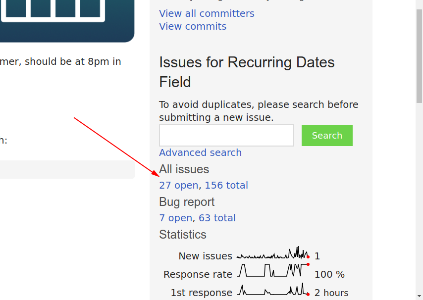
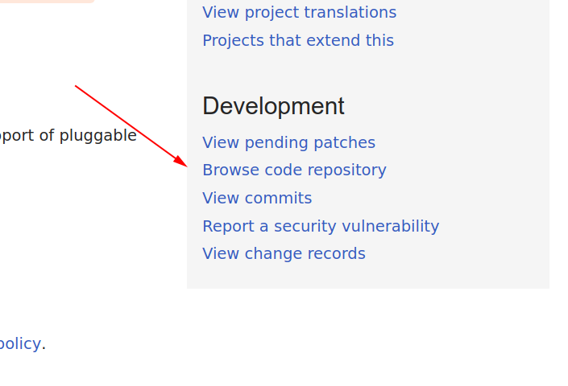
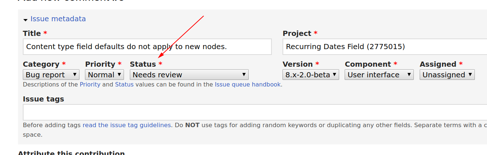

Somehow, I've been developing in Drupal for over a year now. I've worked with Drupal 7 and Drupal 8 sites, added functionality to existing sites and worked on teams building a site for a client from scratch.

Drupal has a large and vibrant open-source community. It is a very powerful and complex piece of software that has thousands of modules shared for free through the Drupal project.

Unsurprisingly, those modules are never perfect and sometimes need fixing. I was working on a something today and wanted to contribute my fix back to the module. The process wasn't as easy as I'd like it to be and I wanted to share it here.

The module I was contributing to was the `date_recur` module but this workflow would work with any contributed module or even the core modules themselves.

The first thing to do was to checkout the issue queue - has this been something others have fixed or tried to fix? Is it a problem that others have had? You can find this on the right-hand side of the project page.



Once you've searched through the issues and made sure that it hasn't already been fixed it's time to prepare your patch.

You'll first need to get a fresh git clone of the module you want to patch. Go back to project page and on the right-hand side find `Browse code repository` in the `Development` section.



If you scroll right to the bottom of that page, you'll see a `Clone` section with a link. For me, that is `https://git.drupal.org/project/date_recur.git`. Use this link to clone the module to a fresh directory, preferable not in any source controlled project.

```
git clone https://git.drupal.org/project/date_recur.git
```

Next, copy in any of the code that you have changed in the module on your local machine. Running a `git status` command should show all of the changes you have made.

Time now to create the patch. The naming standards for patches on Drupal are [description]-[issue-number]-[comment-number].patch. The _description_ is the human readable summary of the issue, the _issue number_ is found in the URL in the issue queue and the _comment number_ is where your patch will be in the conversation.

To make the patch I ran:

```
git diff > apply_field_default_timezone_to_widget-3030603-3.patch
```

Once you're happy that the patch is ready to go, head back to the issue queue and start a new comment.

Below the text field, there is a widget to upload a file and to select which version of the module it should be tested against. Write your comment, choose and upload your file and select `Save`.

The last thing to do now, is to alert the maintainers and anyone else who is contributing that this issue needs review. At the bottom of the issue there is an `Issue metadata` section. Expand this and change the status to `Needs review`.



That's it! I haven't heard back about my submission yet but I have been able to use it in my own `composer.json` file and work with the patched version for the site I'm working on.
