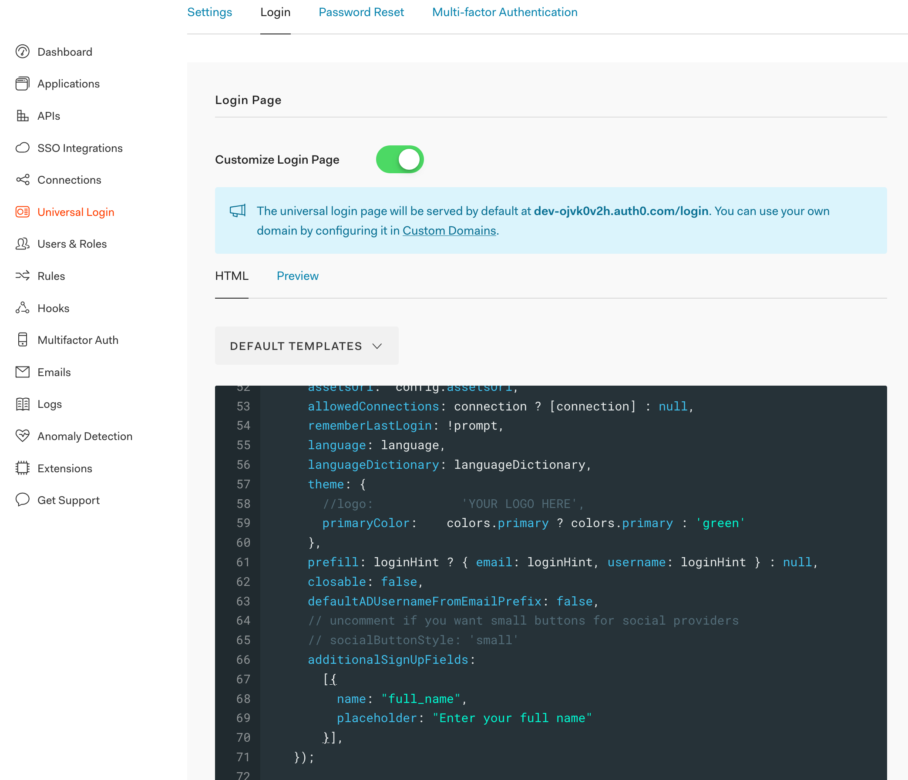

Since I started freelancing, I've been working on a number of interesting projects.
A lot of these have been prototypes to help scope out the viability of ideas 
before clients decide to dive headlong into full development.

In that kind of scenario, building all of the components of an application isn't
the best use of time. Instead, you want to tie together tools that do a single 
job well and, once that plumbing is done, apply time and energy to more relevant
features.

Auth0 is an awesome solution for authentication and login. They have excellent
login and logout flows and are easy to integrate with. We've had some fun getting
them to work well with NextJS but have largely been successful.

I was faced with a problem this week. Auth0 provides a sign-up workflow that by
default captures the email of the user and I wanted to get more information during
that process and send it on to my application. 

You can configure other social logins such as Google and Facebook which send 
some more detail through but I want to focus on the email flow.

Adding another field to the Sign Up form took a bit of working out but I got it.

I've tried to capture all the relevant parts in the screen shot. Universal login
from the right, login at the top and then toggle the custom login switch.

The new field is added by the `additionalSignUpField` key in the configuration
object. The value has to be an *array* and can have a validator. If you don't 
provide a validator then it will be a compulsory field. More details over in the
[Auth0 docs here](https://auth0.com/docs/libraries/lock/v11/configuration). 

This 

